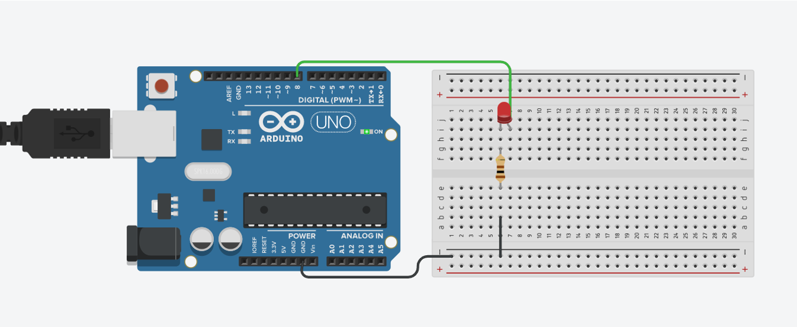

# SCHRÖDINGER's CAT

## Description
Developted an Arduino project to simulate a sensor for a cat's door.

 - Simulated the cat behavior using a random function.
 - Implemented an **EEPROM** storage to remember where was the cat before an arduino restart.
 - Avoided the use of the ***delay*** function in the main loop.

---

## Circuits Connections



Pin **8** as **OUTPUT**, and conected to the *Anode* of a LED

```C++
    pinMode(8, OUTPUT)
```

The *Cathode* of the **LED** must be connected with a resistor to the **GND** of the Arduino.

---
## Usage
To make use of this repository correctly, follow the next steps.

1. First of all you would need to clone this repository, in the terminal put the next code to clone this repository:

```sh
    git clone https://github.com/Rafael-Anguiano/Schrodinger-s-cat.git
    cd Schrodinger-s-cat/
```

2. Make the connections shown [above](#Circuits-Connections)

3. Once you have made the connections, you need to open the [Schrodinger-s-cat.ino](./Schrodinger-s-cat.ino) code in an **Arduino Simulator** or an **Arduino IDE** 
4. Upload the code to your Arduino and you would be ready to go.

> 5. You can *press* the **restart button** on your Arduino if you want, and it will start with his last state saved on the memory.
> 6. The state of the cat is shown in the ***Serial monitor*** 

---
## Notes:

1. In the serial monitor you can see some 0s and some 1 followed by a phrase
    - 0 means that the cat is staying where it is.
    - 1 means that the cat is changing its position.
    - The phrase tells you what the cat did, **salio** if the cat is going outside, **entro** if the cat is going inside the house. 

---

## Developed By:
 Rafael de Jesús Anguiano Suárez del Real (March 2021)